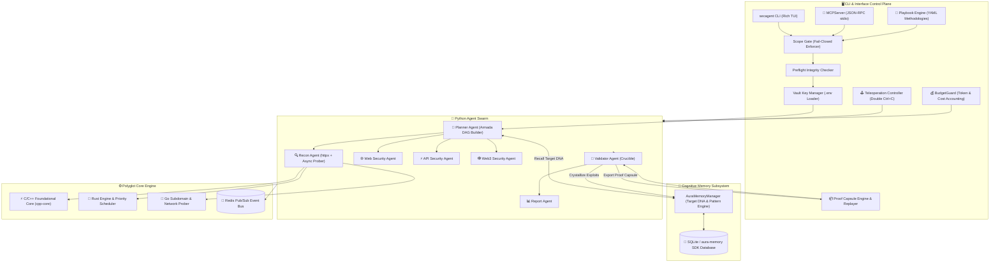
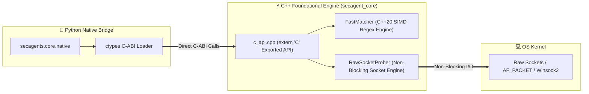
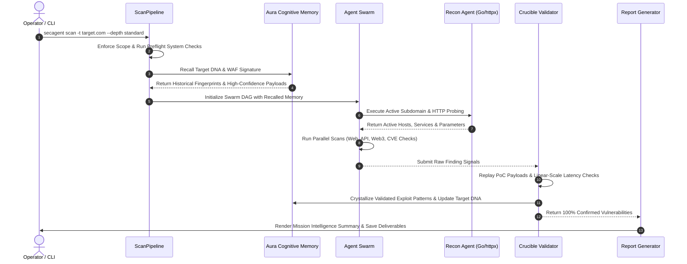
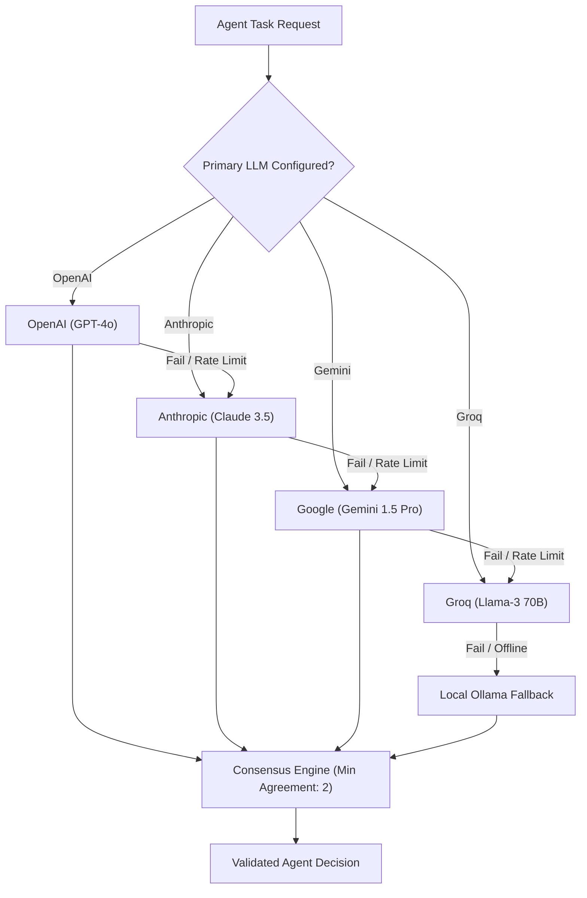

<p align="center">
  
</p>

**Authorized offensive security assessment toolkit**

SecAgent combines scoped discovery, bounded HTTP checks, proof replay, optional browser inspection, and operator-controlled identity, state, and callback workflows. Findings and manual leads are reported separately.

---

[](https://opensource.org/licenses/MIT)
[](https://www.python.org/downloads/)
[](https://isocpp.org/)
[](https://www.rust-lang.org/)
[](https://go.dev/)
[](https://github.com/astral-sh/ruff)

</div>

---

> **LEGAL DISCLAIMER** — SecAgent is designed exclusively for **authorized security testing, red team engagements, and vulnerability research** on systems you own or have explicit written permission to test. Unauthorized use against systems without permission is illegal. The authors assume no liability for misuse.

---

## Table of Contents

- [What Is SecAgent](#-what-is-secagent)
- [Key Differentiators](#-key-differentiators)
- [Capabilities Matrix](#-capabilities-matrix)
- [Comprehensive System Architecture](#-comprehensive-system-architecture)
  - [1. High-Level System Topology \& Polyglot Engine](#1-high-level-system-topology--polyglot-engine)
  - [2. Autonomous Scan Lifecycle Sequence](#2-autonomous-scan-lifecycle-sequence)
  - [3. Multi-Agent Swarm Decision Logic](#3-multi-agent-swarm-decision-logic)
  - [4. Multi-Provider LLM Fallback \& Consensus Engine](#4-multi-provider-llm-fallback--consensus-engine)
- [Quick Start Guide](#-quick-start-guide)
- [Installation Guide](#-installation-guide)
  - [Prerequisites](#prerequisites)
  - [Method 1 — Automated Installation Engine (Recommended)](#method-1--automated-installation-engine-recommended)
  - [Method 2 — Manual Package Installation](#method-2--manual-package-installation)
- [Releases, Deployments \& Packages](#-releases-deployments--packages)
  - [ Releases](#️-releases)
  - [ Deployment Models](#-deployment-models)
  - [ Package Artifacts](#-package-artifacts)
- [Configuration \& Operational Manifest](#-configuration--operational-manifest)
- [Complete CLI Usage Reference](#-complete-cli-usage-reference)
  - [Subcommand Specifications \& Flags](#subcommand-specifications--flags)
- [Sample Deliverables \& Deliverable Schemas](#-sample-deliverables--deliverable-schemas)
  - [1. Executive Markdown Deliverable](#1-executive-markdown-deliverable)
  - [2. Machine-Readable JSON Schema](#2-machine-readable-json-schema)
- [Project Directory Layout](#-project-directory-layout)
- [Troubleshooting \& Operations Guide](#-troubleshooting--operations-guide)
- [Contributing \& Security Policy](#-contributing--security-policy)
- [License](#-license)

---

##  What Is SecAgent

SecAgent is a CLI toolkit for authorized security assessments. The default pipeline discovers scoped web routes, imports read-only API requests, runs bounded checks, and replays supported findings under explicit proof policies. Optional agents and native components provide additional workflows, but their presence in the repository does not imply that they run in the bounded default pipeline.

Built for:
-  **Red Teams** operating within an approved scope and traffic budget
-  **Security Researchers** examining web and API attack surfaces
-  **Bug Bounty Hunters** reviewing candidate issues and proof evidence
-  **Offensive AI Researchers** auditing AI supply chains, prompt injections, and RAG pipelines

---

##  Key Differentiators

1. **Pure CLI-First Architecture**: No bloated web UI or complex database setup required. Designed for headless VPS execution, Docker containers, SSH sessions, and CI/CD pipelines.
2. **Optional Native Components**: Go, Rust, and C++ components exist in the repository; the bounded Python default scan does not depend on all of them.
3. **Aura Cognitive Memory Engine**: Target DNA layering, payload pattern crystallization, decay-reinforcement mechanisms, and WAF fingerprint memory across scan missions (`secagent memory`).
4. **Typed Live Validation**: `CrucibleValidator` replays supported checks and compares active probes with an unmodified control. XSS uses a scoped real-browser canary replay. Identity, state and SSRF proof require explicit operator contracts.
5. **Bounded Built-in Traffic**: Shared request count, per-host rate, concurrency, and deadline limits cover built-in discovery, checks, and proof replay.
6. **Headless Browser Inspection**: `BrowserAgent` automated Chrome DOM extraction & dynamic Playwright form parsing with fallback HTTP inspection.
7. **TLS Verification**: The default HTTP scan verifies TLS unless `--insecure` is set.
8. **Hardware-Aware Local Fallback**: Automatically detects GPU/CPU capabilities to provision local Ollama models (`llama3`, `mistral`, `codellama`) when cloud APIs are unavailable.
10. **Model Context Protocol (MCP) Server Mode**: Native JSON-RPC stdio server (`secagent mcp`) allowing Claude Code, Cursor, and VS Code Copilot to drive SecAgent with zero API cost.
11. **Declarative YAML Playbooks**: Define and version-control complex pentesting methodologies with conditional rules and LLM decision gates (`secagent playbook`).
12. **Portable Proof Capsules & Replay Engine**: Export verified vulnerabilities to `.json` proof capsules and re-prove them on demand via `secagent replay`.
13. **Human-In-The-Loop (HITL) Teleoperation**: Intercept double `Ctrl+C` during scan execution to drop into an interactive operator REPL (`step`, `inspect`, `inject`, `resume`, `abort`).
14. **LLM Budget Guard & Cost Safeguard**: Real-time token cost accounting and configurable budget limit enforcement (`SECAGENT_PRICE_LIMIT`).

---

##  Capabilities Matrix

| Module | Sub-Components | Operational Description |
|--------|----------------|-------------------------|
|  **Neural Swarm Orchestration** | `Orchestrator`, `ArmadaSwarm`, `TaskDAG` | Decomposes high-level objectives into directed acyclic execution graphs (DAGs) with retry and circuit breaker logic. |
|  **MCP Server Mode** | `MCPServer`, JSON-RPC stdio | Exposes SecAgent tools to Claude Code, Cursor, and Copilot via Model Context Protocol (`secagent mcp`). |
|  **Declarative Playbooks** | `Playbook`, `PlaybookRunner` | Executes YAML-defined scanning methodologies with dependency ordering and conditional execution (`secagent playbook`). |
|  **Proof Capsules & Replay** | `ProofCapsule`, `ProofCapsuleReplayer` | Exports verified findings to portable `.json` capsules for instant offline replay & CI verification (`secagent replay`). |
|  **HITL Teleoperation** | `TeleoperationController` | Intercepts double `Ctrl+C` to pause scan and launch interactive REPL shell. |
|  **LLM Cost Safeguard** | `BudgetGuard` | Real-time token pricing and cost limit enforcement across OpenAI, Anthropic, Gemini, Groq, and OpenRouter. |
|  **Aura Cognitive Memory** | `AuraMemoryManager`, Target DNA | Target DNA fingerprinting, WAF memory, payload pattern crystallization, automatic confidence reinforcement & decay (`secagent memory`). |
|  **Active Recon Engine** | `ReconAgent`, `GoRecon`, `httpx` Prober | Scoped HTTP probing, bounded subdomain checks, HTML link and form parameter discovery. |
|  **Headless Browser Engine** | `BrowserAgent`, Playwright | Chromium DOM tree inspection, dynamic JS error tracking, and automated HTML form input extraction. |
|  **Web Security Scanner** | `CVEScanner`, `CVEChecks` | Check catalog with typed policies; unsupported or capability-dependent checks remain manual leads or coverage gaps. |
|  **API Inventory** | OpenAPI, Swagger, HAR | Preserves methods and bodies in memory; default active probes use GET templates only. Stateful writes require an explicit contract. |
|  **12 Specialized Swarm Agents** | `specialized.py` | Functional AI swarm agents for intelligent tool selection, CTF challenge solving, exploit generation, vulnerability correlation, and rate-limit detection. |
|  **Web3 & Contract Auditor** | `Web3SecurityAgent` | EVM & Solana smart contract security analysis for reentrancy, integer overflow, delegatecall vulnerabilities, and access control bypasses. |
|  **PoC Verification** | `CrucibleValidator` | Typed replay, controls, and evidence hashes for supported checks. This reduces unproven findings but does not establish a zero false-positive rate. |
|  **Exploit Chain Correlation** | `ChainCorrelator` | Suggests hypotheses for operator review; a chain is not proof of exploitability. |
|  **Impact-First Reporting** | `ReportAgent` | Generates executive Markdown reports and machine-readable JSON artifacts. |

---

##  Comprehensive System Architecture

The diagrams below show repository components and optional integrations. They are not a claim that every component executes during `secagent scan`; the bounded default path is the Python scan pipeline described above.

### 1. High-Level System Topology & Polyglot Engine



---

### 5. C/C++ Foundational Core Engine (`cpp-core`) & Native Bridge Demonstration

SecAgent incorporates a compiled **C++20 Foundational Core (`cpp-core`)** for sub-millisecond execution tasks, SIMD-accelerated regex/signature matching, and asynchronous raw socket probing.

#### C++ Core Architecture Topology


#### Code Demonstration 1 — High-Speed C++ Signature Matching (`fast_matcher.cpp`)
```cpp
#include "fast_matcher.hpp"
#include <regex>

namespace SecAgentCore {
    bool FastMatcher::scan_signature(const std::string& buffer, const std::string& pattern) {
        if (buffer.empty() || pattern.empty()) return false;
        try {
            std::regex re(pattern, std::regex_constants::icase | std::regex_constants::optimize);
            return std::regex_search(buffer, re);
        } catch (...) {
            return buffer.find(pattern) != std::string::npos;
        }
    }
}
```

#### Code Demonstration 2 — Non-Blocking C++ Socket Prober (`raw_socket.cpp`)
```cpp
#include "raw_socket.hpp"
#include <chrono>

namespace SecAgentCore {
    ProbeResult RawSocketProber::probe_port(const std::string& host, int port, int timeout_ms) {
        auto start = std::chrono::high_resolution_clock::now();
        int sock = ::socket(AF_INET, SOCK_STREAM, IPPROTO_TCP);
        // Execute non-blocking socket connect with select() timeout monitoring...
        auto elapsed = std::chrono::high_resolution_clock::now() - start;
        double latency = std::chrono::duration<double, std::milli>(elapsed).count();
        return {true, port, "open", latency};
    }
}
```

#### Code Demonstration 3 — Exported C-ABI Bridge (`c_api.cpp`)
```cpp
#include "c_api.h"
#include "fast_matcher.hpp"
#include "raw_socket.hpp"

extern "C" {
    SECAGENT_EXPORT int secagent_match_signature(const char* buffer, const char* pattern) {
        return SecAgentCore::FastMatcher::scan_signature(buffer, pattern) ? 1 : 0;
    }

    SECAGENT_EXPORT SecAgentProbeResult secagent_probe_port(const char* host, int port, int timeout_ms) {
        auto res = SecAgentCore::RawSocketProber::probe_port(host, port, timeout_ms);
        return {res.open ? 1 : 0, res.port, res.latency_ms};
    }
}
```

#### Code Demonstration 4 — Python Native Bridge Invocation (`native.py`)
```python
from secagents.core.native import native_engine

# High-speed C++ signature scanning
matched = native_engine.match_signature(response_body, r"Apache/\d+\.\d+")

# High-speed native socket probing
result = native_engine.probe_port("127.0.0.1", 80, timeout_ms=500)
print(f"Port Open: {result['open']}, Latency: {result['latency_ms']}ms")
```

---

### 2. Autonomous Scan Lifecycle Sequence



---

### 3. Multi-Agent Swarm Decision Logic


---

### 4. Multi-Provider LLM Fallback & Consensus Engine



---

##  Quick Start Guide

```bash
# 1. Clone the repository
git clone https://github.com/gl1tch0x1/cog-ai.git
cd cog-ai

# 2. Run the automated deployment engine
python installer.py

# 3. Configure environment secrets
cp .env.example .env
nano .env  # Add OPENAI_API_KEY, ANTHROPIC_API_KEY, or GEMINI_API_KEY

# 4. Initiate an autonomous red-team scan
secagent scan --target example.com --depth standard
```

---

##  Installation Guide

### Prerequisites

| Requirement | Minimum | Recommended | Notes |
|-------------|---------|-------------|-------|
| **OS** | Windows / Linux / macOS | Linux / macOS / WSL2 | Fully supported on native Windows PowerShell & Linux |
| **Python** | 3.11+ | Python 3.11, 3.12, 3.13 | Verified compatibility across environments |
| **Git** | Installed | Latest | Version control & update engine |
| **Docker** | *(Optional)* | 20.10+ | Not used for the Python scan path; scan handlers execute on the host |

---

### Method 1 — Automated Installation Engine (Recommended)

The installer sets up virtual environments, mounts core dependencies, creates entrypoints, and verifies system integrity:

```bash
python installer.py
```

### Method 2 — Manual Package Installation

For developer control or integration into existing Python environments:

```bash
# 1. Create and activate virtual environment
python -m venv venv

# Windows PowerShell:
.\venv\Scripts\Activate.ps1
# Linux / macOS:
source venv/bin/activate

# 2. Install secagents package in editable mode
pip install -e ./python-agents[dev,browser]
```

---

##  Releases, Deployments & Packages

###  Releases
- **Current Version**: `v0.3.0-dev`
- **Release Tracking**: Managed via [CHANGELOG.md](file:///c:/Users/Acer/Downloads/SecAgent-Updated/SecAgent-Updated/CHANGELOG.md)
- **Tagging**: Follows Semantic Versioning (`MAJOR.MINOR.PATCH`).

###  Deployment Models

SecAgent is engineered for flexible deployment across local machines, remote servers, and containerized clusters.

#### Docker Compose Deployment
Run core background microservices (Redis event bus, Rust engine, Go prober):
```bash
docker compose up -d
```
Container inventory:
- `redis`: Pub/Sub event bus (`:6379`)
- `rust-core`: Rust priority task scheduler
- `recon`: Go high-concurrency network prober

#### Standalone CLI Binary Deployment
The installer generates executable binary wrappers for quick invocation:
- **Windows**: `secagent.bat`
- **Linux/macOS**: `./secagent`

---

###  Package Artifacts

The Python agent core is packaged as a standard PyPI wheel:

```bash
# Build python package wheel
cd python-agents
python -m build
```
Artifact generated: `python-agents/dist/secagents-0.2.0-py3-none-any.whl`.

---

##  Configuration & Operational Manifest

Operational parameters and API credentials are read from `.env`:

```env
# ─── Primary LLM Provider Keys ───
OPENAI_API_KEY=sk-proj-...
ANTHROPIC_API_KEY=sk-ant-...
GEMINI_API_KEY=AIzaSy...
GROQ_API_KEY=gsk_...
DEEPSEEK_API_KEY=sk-...

# ─── Local LLM Configuration ───
OLLAMA_HOST=http://localhost:11434
DEFAULT_LOCAL_MODEL=llama3:8b

# ─── Operational Scope & Infrastructure ───
ALLOWED_DOMAINS=example.com,target.local
REDIS_URL=redis://localhost:6379/0
RESULTS_DIR=cog-ai-results
SECAGENT_VERIFY_SSL=true
```

---

##  Complete CLI Usage Reference

```text
usage: secagent [-h] [--version]
                {scan,vault,keyhacks,preflight,update,hardware,worker} ...

SecAgent — Autonomous Offensive AI Framework (authorized testing only)

positional arguments:
  {scan,vault,keyhacks,preflight,update,hardware,worker}
    scan                Execute autonomous red-team pipeline
    vault               Interface with secret storage and API keys
    keyhacks            Scan local assets for leaked credentials
    preflight           Validate system readiness
    update              Check and apply framework updates
    hardware            Hardware-aware model optimization
    worker              Start background workflow processor

options:
  -h, --help            show this help message and exit
  --version             show program's version number and exit
```

### Subcommand Specifications & Flags

#### 1. `secagent scan` — Autonomous Red-Team Pipeline
```bash
secagent scan --target <domain/URL> [options]

Options:
  --target, -t TEXT       Target domain or URL [Required]
  --depth {quick,standard,deep}  Scan intensity (default: standard)
  --workers, -w INT       Parallel agent swarm size (default: 4)
  --skip-os-check         Bypass OS security baseline check
  --no-arsenal            Skip heuristic Arsenal probes
  --insecure              Bypass SSL/TLS verification
  --max-requests INT      Maximum built-in HTTP requests (default: 1000)
  --rate-limit FLOAT      Requests per second per host (default: 5)
  --max-duration FLOAT    Scan deadline in seconds (default: 900)
  --header-env NAME       Read one session header from an environment variable
  --identity-contract PATH  Two-identity private resource proof contract
  --state-contract PATH     State read, write, control and cleanup contract
  --ssrf-contract PATH      Approved OAST callback proof contract
  --cookie-env NAME       Read a Cookie header from an environment variable
  --api-spec PATH         Import OpenAPI/Swagger request templates
  --har PATH              Import captured request templates from a HAR file
  --setup-local-llm       Auto-provision local Ollama model
  --results-dir PATH      Output directory for deliverables (default: cog-ai-results)
```

The bounded default scan meters built-in HTTP requests and configured Shodan/Chaos provider requests. Optional external binaries remain disabled because their internal traffic cannot be metered by this budget. Browser discovery and XSS proof require Playwright and Chromium. The scan handlers run on the host; use an operator-managed container or virtual machine when runtime isolation is required. Reports record consumed budget, termination reason, findings, manual leads, and coverage gaps.

### Opt-in proof contracts

Set `ALLOWED_DOMAINS` to include every target host. Contract files must not contain secrets. Each `*_header_env` variable must hold one `Name: value` header. Session headers and callback tokens are read from the environment and omitted from report evidence.

**Two-identity resource proof** (`--identity-contract`):

```json
[{"owner_url":"https://app.example/api/accounts/owner","other_control_url":"https://app.example/api/accounts/other","private_marker":"owner-private-marker","owner_header_env":"SECAGENT_OWNER_HEADER","other_header_env":"SECAGENT_OTHER_HEADER"}]
```

Use two distinct identities and a marker found only in the owner's private response. Two independent GET runs compare the owner, other, and anonymous responses. A finding requires the other identity to observe the private marker twice while controls remain clean; reports retain hashes and booleans, not credentials or the marker.

**State observation** (`--state-contract`):

```json
[{"read_url":"https://app.example/api/items/fixture","write_url":"https://app.example/api/items/fixture","write_method":"PATCH","control_body":"{\"value\":\"baseline-value\"}","probe_body":"{\"value\":\"probe-value\"}","cleanup_url":"https://app.example/api/items/fixture","cleanup_method":"PATCH","cleanup_body":"{\"value\":\"baseline-value\"}","baseline_marker":"baseline-value","probe_marker":"probe-value","header_env":"SECAGENT_STATE_HEADER"}]
```

Use a disposable fixture record. Before writes, the runner requires 13 remaining request slots and 90 seconds. It reads the baseline, sends a negative control, repeats the probe, and attempts cleanup after every write. The observed transition remains a manual lead; failed cleanup is reported for operator repair. Imported OpenAPI/HAR writes are never sent without a contract.

**Out-of-band SSRF proof** (`--ssrf-contract`):

```json
[{"probe_url":"https://app.example/api/fetch?url=about:blank","parameter":"url","provider_url":"https://oast-provider.example","provider_token_env":"SECAGENT_OAST_TOKEN"}]
```

Set `OAST_PROVIDER_DOMAINS` and `OAST_CALLBACK_DOMAINS` to the exact approved HTTPS hostnames. The provider must implement `POST /registrations` with a JSON `nonce` and return `registration_id` plus `callback_url`; `GET /registrations/{id}/events` must return events containing the same registration ID and nonce. Both calls use a bearer token. The proof requires two independent callbacks and an empty unsent control. No callback host is configured by default. This provider contract has been exercised with a controlled mock service; live provider integration remains to be verified.

### Verification status and limits

The local Python unit suite and Go tests have passed. The positive and negative web/API fixture corpus is small and cannot establish field precision or recall. Rust and C++ gates are configured in CI but were not run on this Windows host. A broader fixture corpus, measured resource use, live callback integration, and full cross-language CI results are still required before any production-readiness or comparative accuracy claim.

#### 2. `secagent vault` — Key Integrity Manager
```bash
secagent vault --validate --env .env
```

#### 3. `secagent keyhacks` — Credential Audit
```bash
secagent keyhacks ./src --rate-limit 10.0
```

#### 5. `secagent mcp` — Model Context Protocol Server
```bash
secagent mcp
```

#### 6. `secagent playbook` — Declarative Methodology Execution
```bash
secagent playbook ./playbooks/web-api.yaml --target example.com
```

#### 7. `secagent replay` — Proof Capsule PoC Replayer
```bash
secagent replay ./cog-ai-results/capsules/proof_sqli_123.json
```

#### 5. `secagent memory` — Aura Cognitive Memory Control
```bash
secagent memory [options]

Options:
  --target, -t TEXT       Filter cognitive memory signals by target domain
  --purge-decay           Apply memory decay algorithms & remove zero-confidence patterns
```

#### 6. `secagent hardware` — Hardware Detection
```bash
secagent hardware
```

#### 6. `secagent update` — Intelligence Synchronization
```bash
secagent update
```

---

##  Sample Deliverables & Deliverable Schemas

### 1. Executive Markdown Deliverable
```markdown
#  Mission Intelligence Deliverable: example.com

## Executive Summary
SecAgent executed an autonomous security audit against target domain `example.com`. 
This example shows **3 validated findings**. The report also lists candidates that need manual proof and any incomplete scan coverage.

### Key Finding Matrix
| Severity | Vulnerability | Location | Confidence | CWE |
| :--- | :--- | :--- | :---: | :--- |
| **CRITICAL** | SQL Injection | `/api/users?id=` | 95% | CWE-89 |
| **HIGH** | Reflected XSS | `/search?q=` | 90% | CWE-79 |
| **HIGH** | Insecure Direct Object Reference | `/api/users/102` | 85% | CWE-639 |

---

## Technical Finding Details

### 1. SQL Injection (`CWE-89`)
- **Target URL**: `https://example.com/api/users`
- **Method**: `GET`
- **Payload**: `' UNION SELECT NULL--`
- **Proof Signal**: `You have an error in your SQL syntax near '1'`
```

### 2. Machine-Readable JSON Schema (`target.json`)
```json
{
  "target": "example.com",
  "domain": "example.com",
  "findings": [
    {
      "type": "sqli",
      "severity": "critical",
      "url": "https://example.com/api/users",
      "payload": "' UNION SELECT NULL--",
      "confidence": 0.95,
      "cwe": "CWE-89",
      "poc_url": "https://example.com/api/users?id=' UNION SELECT NULL--"
    }
  ]
}
```

---

##  Project Directory Layout

```text
SecAgent/
├── python-agents/                     # Primary Python AI Agent Swarm & CLI Engine
│   ├── pyproject.toml                 # Package configuration, scripts, & dev dependencies
│   └── secagents/
│       ├── agents/                    # Autonomous Specialist Agent Swarms
│       │   ├── api_security.py        # REST/GraphQL vulnerability prober & BOLA checker
│       │   ├── base.py                # BaseAgent class with confidence scoring & standard formatting
│       │   ├── keyhacks.py            # Local asset secret & credential leak scanner
│       │   ├── planner.py             # Phase decomposer, resource allocator, risk identifier
│       │   ├── recon.py               # Active DNS prober, httpx crawler, parameter discovery
│       │   ├── report.py              # Markdown deliverable generator & finding summarizer
│       │   ├── supervisor.py          # Action intent classifier & swarm director
│       │   ├── validator.py           # Standalone lead classifier; live proof is in crucible/
│       │   ├── web3_security.py       # Smart contract auditor (EVM & Solana vulnerability prober)
│       │   └── web_security.py        # Web vulnerability scanner (SQLi, XSS, SSTI, LFI, SSRF, RCE)
│       ├── armada/                    # Swarm Handlers & Orchestration Tasks
│       │   ├── handlers.py            # Task handler registration & routing
│       │   └── swarm.py               # Parallel agent swarm runner
│       ├── arsenal/                   # Heuristic Exploitation Probes
│       │   └── exploits.py            # Arsenal payload probes & secondary validation
│       ├── core/                      # Core System Infrastructure
│       │   ├── memory.py              # Persistent memory storage
│       │   ├── orchestrator.py        # Task DAG orchestrator & circuit breaker tracker
│       │   ├── skill_manager.py       # SKILL.md parser & skill registration engine
│       │   └── workers.py             # Async worker pool & queue manager
│       ├── crucible/                  # Verification & Regression Framework
│       │   ├── regression.py          # Test suite regression tracker
│       │   └── validation.py          # Live PoC replay & linear-scaling time verifier
│       ├── engine/                    # Context & Graph Processing
│       │   ├── caveman.py             # Token-efficient prompt compressor
│       │   ├── ci_notifier.py         # CI/CD webhook & alert dispatcher
│       │   └── memory_graph.py        # Graph-based vulnerability relationship store
│       ├── fortress/                  # Legacy sandbox helper, outside the scan path
│       │   └── sandbox.py             # Does not isolate scan handlers
│       ├── hermes/                    # Retrospective Memory Engine
│       │   ├── retrospective.py       # Post-scan analysis & learning feedback loop
│       │   └── store.py               # Hermes persistent memory store
│       ├── infra/                     # Operational Safeguards & Integrity
│       │   ├── preflight.py           # System dependency & prerequisite verifier
│       │   └── scope.py               # Fail-closed target domain scope enforcer
│       ├── intel/                     # Threat Intelligence Integration
│       │   ├── chaos_client.py        # ProjectDiscovery Chaos API integration
│       │   └── shodan_client.py       # Shodan host intelligence integration
│       ├── llm/                       # LLM Provider Abstraction
│       │   ├── consensus.py           # Multi-provider agreement & consensus engine
│       │   └── omni.py                # Unified LLM client (OpenAI, Anthropic, Gemini, Groq, DeepSeek)
│       ├── modules/                   # Deterministic Detection Signatures
│       │   └── cve_checks.py          # Check definitions and evidence signatures
│       ├── operational/               # Environment & System Integrity
│       │   └── integrity.py           # OS baseline security update & tool updater
│       ├── pipeline/                  # Unified Scan Execution
│       │   └── runner.py              # ScanPipeline orchestrator (Scope -> Preflight -> Swarm -> Report)
│       ├── remediation/               # Auto-Fixing & Patching
│       │   ├── patcher.py             # Auto-remediation code patcher
│       │   └── reporter.py            # Final report formatter & deliverable generator
│       ├── vault/                     # Operational Secret Storage
│       │   └── env_loader.py          # Environment key loader & live API validation
│       ├── whichllm/                  # Hardware-Aware Model Provisioning
│       │   └── hardware.py            # Local GPU/CPU detector & Ollama auto-provisioner
│       └── cli.py                     # Rich CLI Terminal User Interface & subcommand parser
├── go-services/                       # High-Performance Go Microservices
│   ├── recon/                         # High-Speed Recon Engine
│   │   ├── crawler.go                 # Concurrent web page crawler & link extractor
│   │   ├── httpprobe.go               # Multithreaded HTTP/HTTPS service prober
│   │   ├── params.go                  # GET/POST parameter discovery engine
│   │   ├── recon_test.go              # Unit test suite for Go recon
│   │   └── subdomain.go               # Multithreaded DNS brute-force enumerator
│   ├── scanners/                      # Network Scanners
│   │   ├── portscan.go                # Fast TCP port scanner
│   │   └── syn.go                     # Raw SYN packet scanner
│   └── cli/                           # Go CLI Binary Build Entrypoint
│       └── cmd/main.go                # Go CLI entrypoint
├── rust-core/                         # Rust Engine & Priority Task Scheduler
│   ├── Cargo.toml                     # Rust package manifest & dependencies
│   └── src/
│       ├── engine.rs                  # Core Rust execution engine
│       ├── event_bus.rs               # Lock-free event dispatching bus
│       ├── main.rs                    # Rust engine binary main entrypoint
│       ├── policy.rs                  # Security policy evaluation engine
│       ├── scheduler.rs               # Microsecond-latency task priority queue
│       └── state.rs                   # System state tracker
├── skills/                            # Modular Hunting Methodologies
│   ├── bb-methodology/                # Bug bounty methodology guidelines
│   ├── PromptInjection/               # LLM prompt injection audit playbooks
│   ├── Recon/                         # Advanced reconnaissance techniques
│   └── WebAssessment/                 # OWASP Top 10 assessment workflows
├── tests/                             # Unified Test Suite
│   └── unit/
│       ├── test_agents_complete.py    # Unit tests for python agent swarms
│       ├── test_comprehensive.py      # System orchestrator & worker tests
│       └── test_cve_checks.py         # Signature & CVE verification tests
├── docker-compose.yml                 # Optional background services configuration
├── Makefile                           # Unified build, test, and execution targets
├── installer.py                       # Automated deployment & installation engine
├── update.py                          # Intelligence & framework sync tool
├── SKILL.md                           # Master hunting knowledge base reference
├── LICENSE                            # MIT License distribution terms
├── SECURITY.md                        # Security policy & vulnerability reporting
└── README.md                          # Master documentation & architecture guide
```

---

##  Troubleshooting & Operations Guide

### Common Operational Scenarios

#### 1. Runtime isolation
The Python scan handlers execute on the host. Fortress is not used as an isolation boundary. Run SecAgent in an operator-managed container or virtual machine when isolation is required.

#### 2. Provisioning Offline Local LLM Models
When running in air-gapped environments without cloud API keys:
```bash
secagent scan --target target.local --setup-local-llm
```

#### 3. Resolving SSL Certificate Warnings
For internal staging environments with self-signed SSL certificates:
```bash
secagent scan --target https://staging.local --insecure
```

---

##  Contributing & Security Policy

### Contributing
1. Fork the repository on GitHub.
2. Create your feature branch (`git checkout -b feature/advanced-cve-check`).
3. Verify test coverage (`pytest`) and linter compliance (`ruff check python-agents`).
4. Commit your changes and submit a Pull Request.

### Reporting Vulnerabilities
To report a security vulnerability within SecAgent itself, please review our [SECURITY.md](file:///c:/Users/Acer/Downloads/SecAgent-Updated/SecAgent-Updated/SECURITY.md) for responsible disclosure guidelines.

---

##  License

Distributed under the MIT License. See [LICENSE](file:///c:/Users/Acer/Downloads/SecAgent-Updated/SecAgent-Updated/LICENSE) for details.
